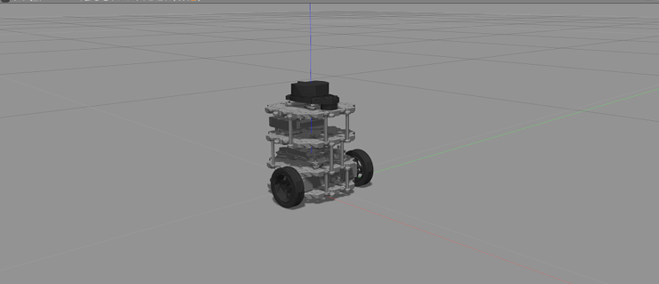
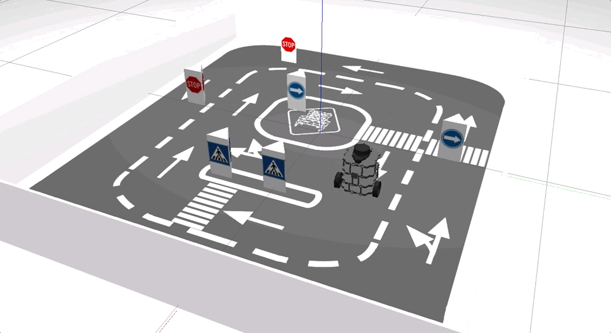
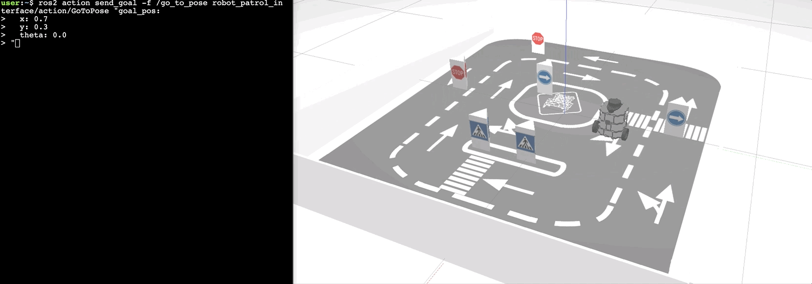

# CityLab Project

The autonomous driving for real robot in city environment imitate a patrolling behavior using ROS2, the patrol behavior is a behavior that makes the robot **move around a specific area indefinitely while avoiding the obstacles in it**.

  

## Structure

```text
.
├── README.md
├── robot_patrol
│   ├── CMakeLists.txt
│   ├── launch
│   │   ├── main.launch.py
│   │   ├── start_direction_service.launch.py
│   │   ├── start_gotopose_action.launch.py
│   │   ├── start_patrolling.launch.py
│   │   └── start_test_service.launch.py
│   ├── package.xml
│   └── src
│       ├── direction_service.cpp
│       ├── go_to_pose_action.cpp
│       ├── patrol.cpp
│       ├── patrol_with_service.cpp
│       └── test_service.cpp
└── robot_patrol_interface
    ├── action
    │   └── GoToPose.action
    ├── srv
    │   └── GetDirection.srv
    ├── CMakeLists.txt
    └── package.xml
```

## Setup

#### Distribution

Use docker for quick-start (for both ROS1 or ROS2):

```sh
# using docker for ROS1
$ docker run -ti --rm --name local-ros-noetic ros:noetic
```

```sh
# using docker for ROS2
$ docker run -ti --rm --name local-ros-humble ros:humble
```

#### Build (Package)

Now, create a catkin workspace, clone the package:

```sh
# setup directory
$ mkdir ~/ros2_ws/src/
$ git clone <repo_name> ~/ros2_ws/src/
```

Install the required packages (dependency) mentioned in `package.xml` using `apt`:

```sh
# check if package is available
$ ros2 pkg list
$ ros2 node list
```

```sh
# update path to installed packages
$ source /opt/ros/humble/setup.bash
```

To build locally or inside docker use the following commands:

```sh
# execute build
$ cd ~/ros2_ws && colcon build
$ source ~/ros2_ws/install/setup.bash
```

#### Bridge

Launch the `ros1_bridge` program to allow communication between ROS1 and ROS2.

```sh
# load parameters
$ source ~/catkin_ws/devel/setup.bash
$ roslaunch load_params load_params.launch
```

```sh
# start bridge
$ source /opt/ros/foxy/setup.bash
$ ros2 run ros1_bridge parameter_bridge
```

## Robot (TurtleBot3)

The `TurtleBot3` is a small, affordable, programmable, ROS-based mobile robot for use in education, research, hobby, and product prototyping.



## Launch

Robot `patrol behavior` can be executed using two launch file, both containing different control logic then the other in the node they execute but with the same goal to achieve (that robot must be moving, while making sure it doesn't get stuck or it hits any obstacle, the entire time).

For the first launch file `start_patrolling.launch.py` robot uses laser reading (`180º` in front) to determine the largest position of free space and move in that direction once robot observe the obstetrical otherwise will keep on moving forward.

```sh
# launch control loop
$ ros2 launch robot_patrol start_patrolling.launch.py
```

The second launch file `main.launch.py` uses the `/direction_service` receive the current laser data from the caller, divide the laser rays received into 3 different sections of `60º` each, add the section value to get largest total, and decide the section towards which the robot must move.

```sh
# launch control loop using direction service
$ ros2 launch robot_patrol main.launch.py
```



Robot `patrol behavior` in the real robot using `main.launch.py` and `ROS1 bridge`.


## Action

The goal is to **create an action server that allows you to send the robot to a certain position**, so it can be used to manually navigate the the robot around the environment. The action utilize custom interface `GoToPose.action` for communication.

```sh
# request
geometry_msgs/Pose2D goal_pos
---
# response
bool status
---
# feedback
geometry_msgs/Pose2D current_pos
```

To launch action node and send goal execute the following commands in terminal:

```sh
# terminal 1
$ ros2 launch robot_patrol start_gotopose_action.launch.py
```

```sh
# terminal 2
$ ros2 action send_goal -f /go_to_pose robot_patrol_interface/action/GoToPose "goal_pos: x: 0.7 y: 0.3 theta: 0.0"
```

Feedback of the action can be viewed in terminal while robot can be observed in simulation.



## Specifications

#### Laser

The robot is mounted with a laser sensor at top which observes complete `360º` around it with total `720` reading (`1` reading for every `0.5º`), but current implementation only uses what in front on the robot i.e. reading from `180` to `540` to calculate the next direction.

## Roadmap

- [x] Part 1 : Create simple patrol behavior for robot.

- [x] Part 2 : Create patrol behavior for robot using service `/direction_service`.

- [x] Part 3 : Create `/go_to_pose` action node for robot control.

See the [open issues](https://github.com/llabhishekll/) for a full list of proposed features (and known issues).

## Tools

System tool/modules used for project development.

- `Applications` : [vs-code](https://code.visualstudio.com/), [ros-extensions](https://marketplace.visualstudio.com/items?itemName=ms-iot.vscode-ros) and [docker-desktop](https://docs.docker.com/get-docker/).
- `ROS` : [ros-docker-images](https://hub.docker.com/_/ros/) (`humble`, `noetic`) or [build-source](https://www.ros.org/blog/getting-started/).

## License

Distributed under the MIT License. See `LICENSE.txt` for more information.
